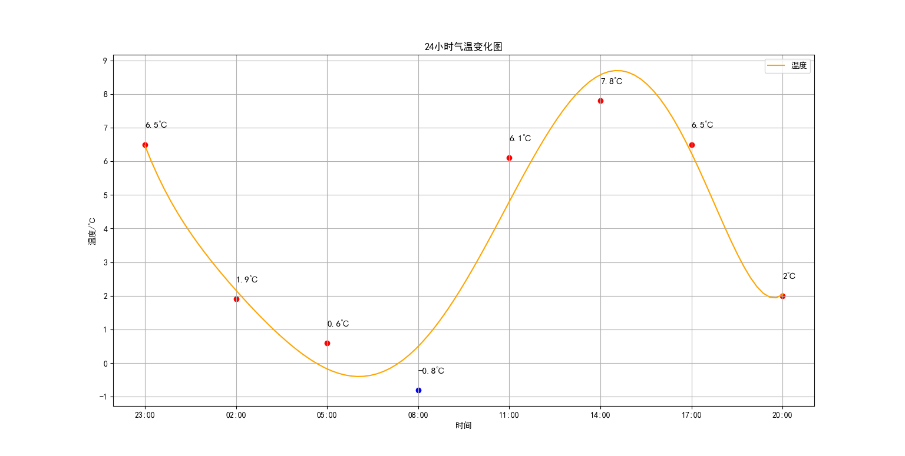
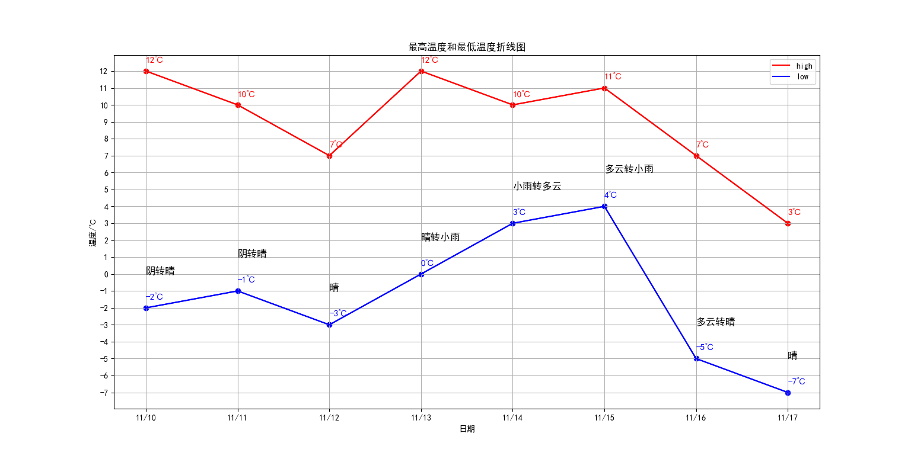
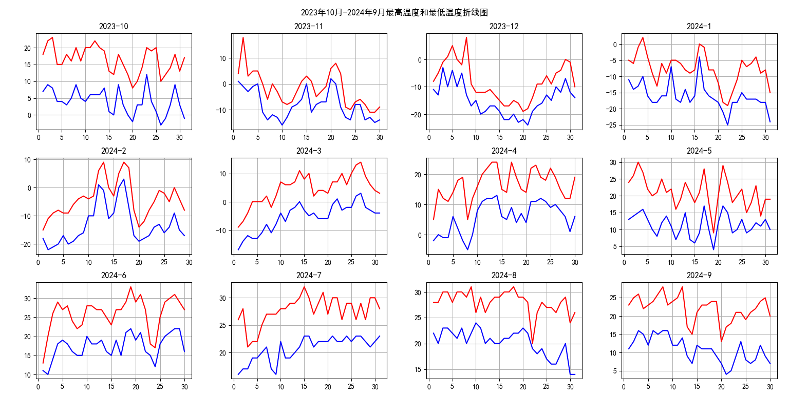
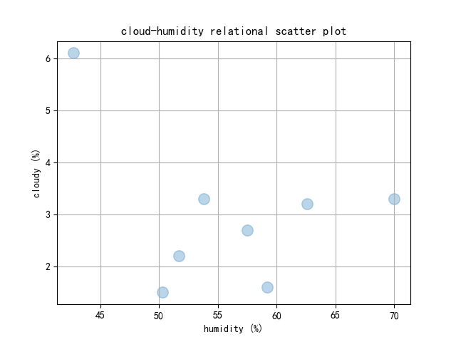

# 效果展示

___
# 编写规范
1. 使用下划线命名法
2. 使用有意义的变量名
3. 写注释

_____
# 环境依赖
- Python 3. 10+
- re
- requests
- beautifulsoup4
- lxml
- gcc
- matplotlib 
- numpy
- selenium
- [EdgeDriver](https://developer.microsoft.com/en-us/microsoft-edge/tools/webdriver/)
